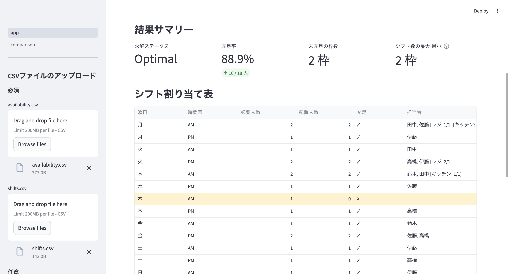

# シフト最適化ツール

CSVでスタッフの出勤可能日時を入力するだけで、制約を満たした最適なシフトを自動生成するツールです。

👉 **手動のシフト作成を自動化し、公平で充足率の高いシフトを瞬時に生成できます。**


[](https://your-app-url.streamlit.app/)


---

## 解決できる課題

- 手動シフト作成に毎週多くの時間がかかっている
- スタッフの出勤希望・スキル・連続勤務などの制約を同時に満たせない
- 特定のスタッフにシフトが偏りがちで不公平感がある
- 人員不足の枠がどこかひと目で分からない

---

## 想定ユースケース

- 飲食店・小売店などのバイトシフト管理
- 工場・倉庫などの勤務シフト管理
- 医療・介護施設のスタッフスケジューリング
- イベントスタッフの配置最適化

---

## デモ
### アプリ画面



### デモURL

Streamlit Cloud でインタラクティブデモを公開しています。  
→ **https://shift-optimizer-9xdsdmuzr8btxelva6glxh.streamlit.app/**

---

## 主な機能

- **CSVによる柔軟な入力**: スタッフ情報・シフト枠・制約をCSVで管理。Excelからそのまま書き出して使える
- **多様な制約への対応**: 連続勤務上限・最低/最大シフト数・固定割り当て・スキル制約に対応
- **公平性の調整**: スライダーで充足率優先と均等割り当て優先のバランスを調整可能
- **infeasible分析**: 制約が厳しすぎて解なしの場合、原因を自動検出して表示
- **アルゴリズム比較**: PuLP（厳密解）と遺伝的アルゴリズム（近似解）を並べて比較
- **結果のCSVダウンロード**: 生成したシフト表をExcelで文字化けなく開けるCSVで出力

---

## 実装アルゴリズム

### PuLP（厳密解）

0-1整数計画問題として定式化し、CBC ソルバーで最適解を求めます。

**決定変数:**

```math
x_{i,d,s} \in \{0, 1\} \quad (1 = \text{スタッフ } i \text{ をシフト枠 } (d,s) \text{ に割り当てる})
```

**目的関数:**

```math
\max \sum_{i,d,s} x_{i,d,s} - \text{fairness\_weight} \times (\max_i S_i - \min_i S_i)
```

充足率を最大化しつつ、公平性の重みでシフト数のばらつきを抑制します。公平性項はソフト制約のため、スタッフが不足する場合は集中が起こることがあります。ハードに縛りたい場合は `min_shifts` / `max_shifts` を使用してください。

**制約:**

| 制約 | 内容 |
|------|------|
| 1人1日1枠 | 同一スタッフが同じ日に複数シフトに入らない |
| 必要人数上限 | 各シフト枠の割り当て人数が必要人数を超えない |
| 固定割り当て | 指定したスタッフを必ずその枠に割り当てる |
| 最低シフト数 | 各スタッフが週に最低N回入る |
| 最大シフト数 | 各スタッフが週にN回を超えて入らない |
| 連続勤務上限 | N+1日連続で勤務しない（ウィンドウ方式） |
| スキル制約 | 各シフト枠に指定したスキル保有者がN名以上入る |

**スキル制約の実装について:**

`x` 変数に加えて $y_{i,d,s,k}$（スキル担当者を示す変数）を導入しています。これにより、複数スキルを持つスタッフが1人で複数スキルをカバーしてしまう問題を防いでいます。

```math
y_{i,d,s,k} \leq x_{i,d,s} \quad (\text{未割り当てはスキル担当になれない})
```
```math
\sum_i y_{i,d,s,k} \geq \text{required}_{d,s,k} \quad (\text{スキル } k \text{ の必要人数を満たす})
```
```math
\sum_k y_{i,d,s,k} \leq 1 \quad (\text{1人が1シフト枠で担当できるスキルは1つまで})
```

### 遺伝的アルゴリズム（近似解）

`numpy` のみを使ったスクラッチ実装です。外部ライブラリ不要なため既存システムへの組み込みが容易です。

**染色体設計:**

```
candidates = [(田中, 月, AM), (田中, 月, PM), (鈴木, 水, AM), ...]
chromosome = [      1,              0,               1,        ...]
              ↑割り当てる       ↑割り当てない     ↑割り当てる
```

**評価関数:**

```math
\text{score} = \sum_{d,s} \min\!\left(\sum_i x_{i,d,s},\ \text{required}_{d,s}\right)
- \text{penalty} \times V
- \text{fairness\_weight} \times (\max_i S_i - \min_i S_i)
```

ここで $V$ は制約違反数の合計、$S_i$ はスタッフ $i$ の割り当てシフト数です。

**GAパラメータ（比較ページのスライダーで調整可能）:**

| パラメータ | デフォルト値 | 説明 |
|-----------|------------|------|
| 個体数 | 100 | 同時に保持する解の数 |
| 世代数 | 300 | 進化を繰り返す回数 |
| 突然変異率 | 0.02 | 1遺伝子あたりのビット反転確率 |

---

## アルゴリズムの使い分け

| 観点 | PuLP（厳密解） | GA（近似解） |
|------|--------------|------------|
| 解の保証 | 最適解が保証される | 保証なし（良好な近似解） |
| 小規模問題 | 高速・最適 | PuLPより遅くなりやすい |
| 大規模問題 | 計算時間が指数的に増加 | 現実的な時間で解が得られる |
| 制約の扱い | 厳密に満たす | ペナルティで軟制約として扱う |
| 公平性の影響 | 最適なバランスを数学的に求める | 重みが大きいと過剰に引っ張られやすい |

スタッフ数十名・シフト枠数十程度であればPuLPの厳密解が現実的です。スタッフ数百名・複雑な制約が絡む大規模問題ではGAなどの近似解法が有効です。

---

## CSVフォーマット

### availability.csv（必須）

スタッフの出勤可能日時。この CSV に含まれない日時には割り当てられません。

```csv
name,day,slot
田中,月,AM
田中,月,PM
鈴木,水,AM
```

| カラム | 値 | 説明 |
|-------|----|------|
| name | 任意の文字列 | スタッフ名 |
| day | 月〜日 | 曜日 |
| slot | AM または PM | 時間帯 |

### shifts.csv（必須）

シフト枠ごとの必要人数。

```csv
day,slot,required
月,AM,2
月,PM,1
```

### staff_constraints.csv（省略可）

スタッフごとの制約。空欄のフィールドは制約なしとして扱われます。

```csv
name,min_shifts,max_shifts,max_consecutive
田中,2,4,3
鈴木,,3,
```

| カラム | 説明 |
|-------|------|
| min_shifts | 週の最低シフト数 |
| max_shifts | 週の最大シフト数 |
| max_consecutive | 連続勤務日数の上限 |

### fixed_assignments.csv（省略可）

特定のスタッフを特定の枠に必ず割り当てる。

```csv
name,day,slot
田中,月,AM
```

### staff_skills.csv（省略可）

スタッフが持つスキルの一覧。1人が複数スキルを持てます。

```csv
name,skill
田中,レジ
田中,キッチン
鈴木,レジ
```

### shift_skills.csv（省略可）

シフト枠ごとに必要なスキルと人数。`staff_skills.csv` と両方アップロードした場合のみ有効になります。

```csv
day,slot,skill,required
月,AM,レジ,1
月,AM,キッチン,1
```

---

## ファイル構成

```
shift-optimizer/
├── app.py                    # メインアプリ（シフト最適化ツール）
├── optimizer.py              # PuLP による厳密解の最適化コア
├── ga_optimizer.py           # 遺伝的アルゴリズムによる近似解
├── requirements.txt          # 依存ライブラリ
├── pages/
│   └── comparison.py         # アルゴリズム比較ページ
└── sample_data/
    ├── availability.csv
    ├── shifts.csv
    ├── staff_constraints.csv
    ├── fixed_assignments.csv
    ├── staff_skills.csv
    └── shift_skills.csv
```

---

## ローカルで実行

```bash
pip install -r requirements.txt
streamlit run app.py
```

---

## 技術スタック

| 分類 | 技術 |
|------|------|
| 最適化（厳密解） | PuLP + CBC ソルバー |
| 最適化（近似解） | 遺伝的アルゴリズム（スクラッチ実装） |
| フレームワーク | Streamlit |
| データ処理 | pandas |
| 数値計算 | NumPy |

---

## 技術的なポイント

- **整数計画問題としての定式化**: シフト割り当てを0-1変数として定式化し、PuLPで厳密最適解を保証
- **スキル担当者変数の導入**: 複数スキル持ちスタッフが1人で複数スキルをカバーする問題を `y` 変数で解決
- **ソフト制約による公平性**: 目的関数に公平性項を追加することで、充足率と均等割り当てのバランスをスライダーで調整可能
- **infeasible自動分析**: 求解不能時に供給不足・制約矛盾・固定割り当て重複などの原因を自動検出
- **GAのスクラッチ実装**: 外部ライブラリ不要で既存システムへの組み込みが容易。評価関数でPuLPと同じ制約をペナルティとして扱い、アルゴリズムの特性の違いを比較可能
- **多対多関係の正規化**: スタッフとスキルを別CSVで管理し、拡張性を確保

---

## 備考

最適化アルゴリズムの実装・比較を目的として開発したプロジェクトです。CSV フォーマットを変えずに実運用に近い問題を解けるよう設計しており、実務での導入・カスタマイズにも対応可能です。

---

## ライセンス

[MIT License](LICENSE)